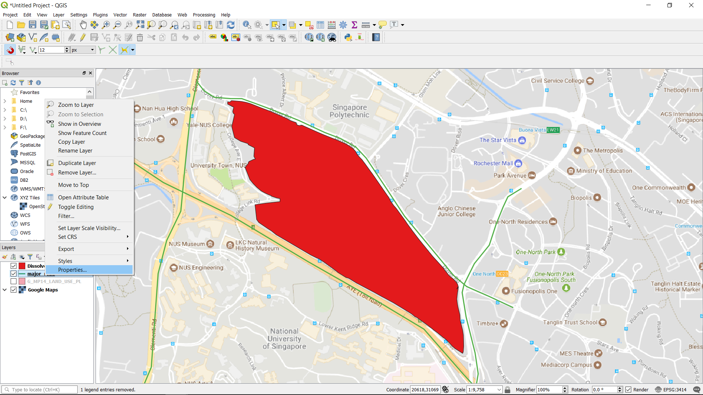

# 14. Change the Fill of a Polyline Feature

**1.\) Right click on the layer -&gt; Properties ...**

**2.\) Choose the Road symbol.**

**3.\) Adjust the width of the road.** 

**4.\) Change the colour to black. Click Apply.**

**5.\) The roads represented.**

